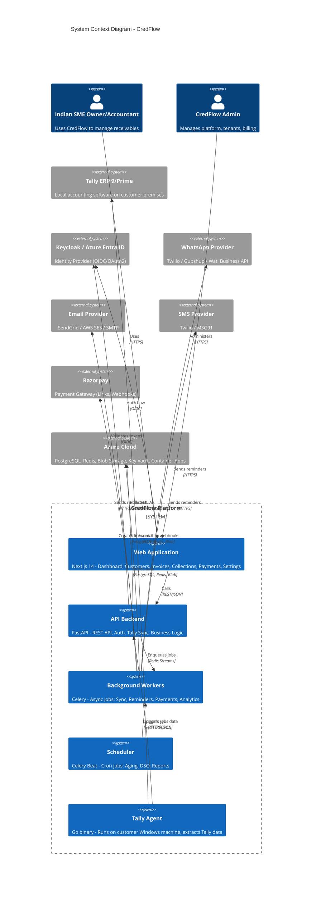
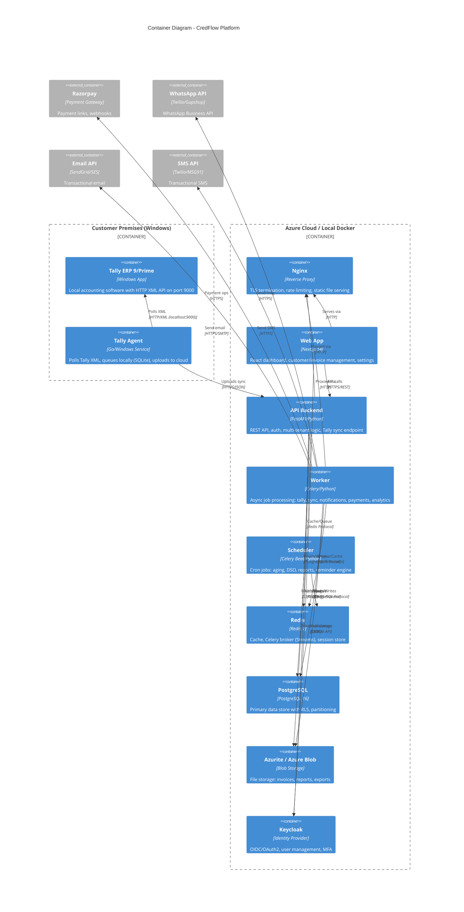
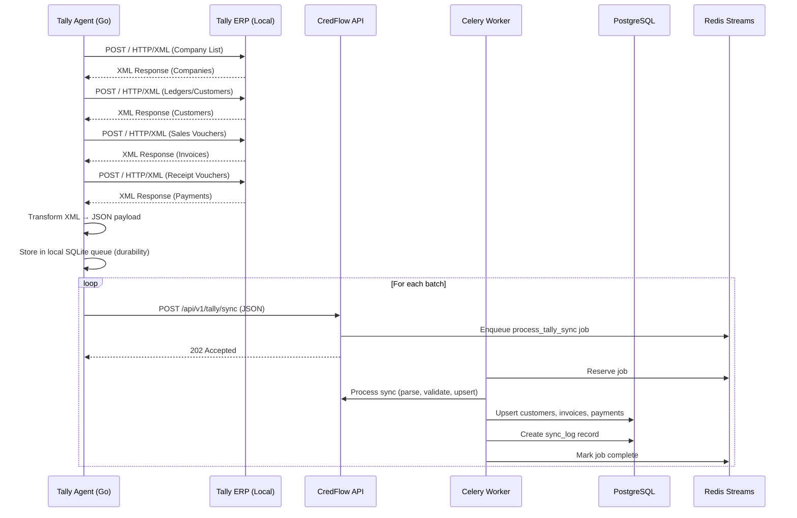
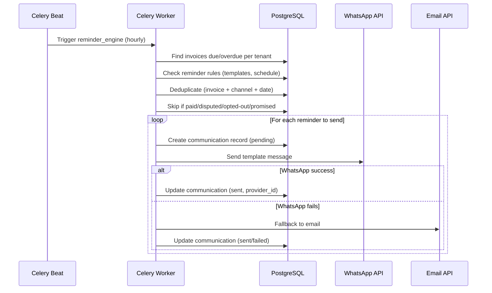

# CredFlow System Architecture (C4 Level 1-2)

## Level 1: System Context



## Level 2: Container Diagram



## Data Flow: Tally Sync



## Data Flow: Reminder Engine



## Infrastructure: Local ↔ Azure Parity

| Component | Local (Docker Compose) | Azure Production |
|-----------|------------------------|------------------|
| **API** | `backend` container | Azure Container Apps |
| **Worker** | `worker` container | Azure Container Apps (scale: 0-10) |
| **Scheduler** | `scheduler` container | Azure Container Apps (single replica) |
| **Frontend** | `frontend` container | Azure Static Web Apps / Container Apps |
| **Nginx** | `nginx` container | Azure Front Door / App Gateway |
| **PostgreSQL** | `postgres:16` | Azure PostgreSQL Flexible Server |
| **Redis** | `redis:7-alpine` | Azure Cache for Redis (Premium) |
| **Blob Storage** | `azurite` | Azure Blob Storage |
| **Key Vault** | `.env` + mock endpoint | Azure Key Vault |
| **Identity** | `keycloak` | Azure Entra ID |
| **Monitoring** | Loki + Grafana + Tempo | Azure Monitor + App Insights |
| **CI/CD** | GitHub Actions | GitHub Actions → Azure |

## Network Architecture (Azure)

```
┌─────────────────────────────────────────────────────────────────┐
│                        Azure VNet                                │
│  ┌─────────────────┐  ┌─────────────────┐  ┌─────────────────┐  │
│  │  Public Subnet  │  │  Private Subnet │  │  Data Subnet    │  │
│  │                 │  │                 │  │                 │  │
│  │ • Front Door    │  │ • Container Apps│  │ • PostgreSQL    │  │
│  │ • App Gateway   │  │   (API, Worker, │  │ • Redis Cache   │  │
│  │ • Static Web App│  │    Scheduler)   │  │ • Blob Storage  │  │
│  │                 │  │ • Key Vault     │  │                 │  │
│  └────────┬────────┘  └────────┬────────┘  └────────┬────────┘  │
│           │                    │                    │           │
│           └────────────────────┼────────────────────┘           │
│                                ▼                                │
│                     ┌─────────────────────┐                     │
│                     │   Private DNS Zones │                     │
│                     │   Service Endpoints │                     │
│                     └─────────────────────┘                     │
└─────────────────────────────────────────────────────────────────┘
```

## Security Boundaries

1. **Internet → Front Door/WAF** → DDoS protection, rate limiting, geo-filtering
2. **Front Door → App Gateway** → TLS termination, path-based routing
3. **App Gateway → Container Apps** → Private networking, no public IPs
4. **Container Apps → PostgreSQL/Redis/Blob** → Private endpoints, service endpoints
5. **Key Vault** → Accessed via Managed Identity, no secrets in code
6. **Tally Agent → API** → mTLS or API Key + HTTPS, domain allowlist