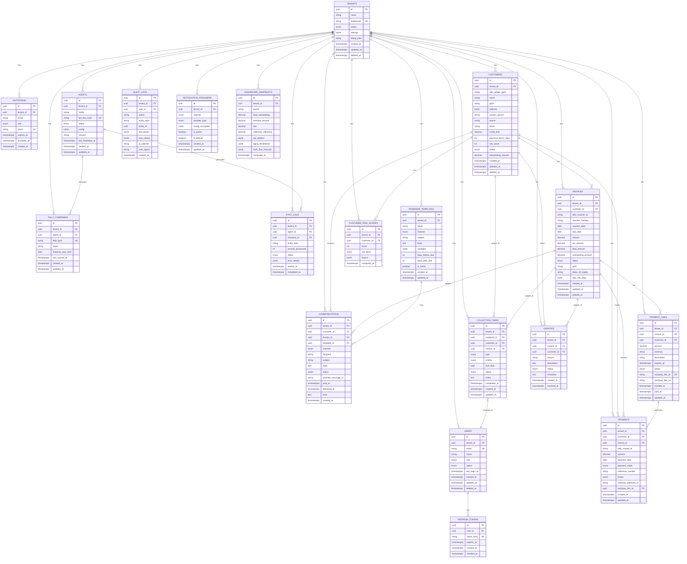

# CredFlow ER Diagram & SQL DDL

## ER Diagram (Mermaid)



## SQL DDL (PostgreSQL 16)

```sql
-- Enable required extensions
CREATE EXTENSION IF NOT EXISTS "uuid-ossp";
CREATE EXTENSION IF NOT EXISTS "pgcrypto";
CREATE EXTENSION IF NOT EXISTS "pg_trgm";

-- Custom ENUM types
CREATE TYPE tenant_status AS ENUM ('active', 'suspended', 'cancelled', 'trial');
CREATE TYPE user_role AS ENUM ('super_admin', 'tenant_admin', 'analyst', 'viewer');
CREATE TYPE user_status AS ENUM ('active', 'inactive', 'pending');
CREATE TYPE agent_status AS ENUM ('active', 'inactive', 'offline', 'updating');
CREATE TYPE sync_status AS ENUM ('pending', 'processing', 'completed', 'failed');
CREATE TYPE invoice_status AS ENUM ('draft', 'sent', 'partial', 'paid', 'overdue', 'disputed', 'cancelled');
CREATE TYPE payment_status AS ENUM ('pending', 'completed', 'failed', 'refunded', 'reconciled');
CREATE TYPE payment_mode AS ENUM ('cash', 'bank_transfer', 'upi', 'card', 'cheque', 'razorpay', 'other');
CREATE TYPE reminder_channel AS ENUM ('whatsapp', 'email', 'sms');
CREATE TYPE communication_status AS ENUM ('pending', 'sent', 'delivered', 'failed', 'bounced');
CREATE TYPE payment_link_status AS ENUM ('active', 'paid', 'expired', 'cancelled');
CREATE TYPE task_type AS ENUM ('call', 'email', 'visit', 'whatsapp');
CREATE TYPE task_priority AS ENUM ('low', 'medium', 'high', 'urgent');
CREATE TYPE task_status AS ENUM ('pending', 'in_progress', 'completed', 'cancelled');
CREATE TYPE dispute_status AS ENUM ('open', 'under_review', 'resolved', 'rejected');
CREATE TYPE risk_level AS ENUM ('LOW', 'MEDIUM', 'HIGH');
CREATE TYPE notification_channel AS ENUM ('whatsapp', 'email', 'sms');
CREATE TYPE provider_type AS ENUM ('twilio', 'gupshup', 'wati', 'sendgrid', 'ses', 'smtp', 'msg91', 'mock');

-- Core function for updated_at trigger
CREATE OR REPLACE FUNCTION update_updated_at_column()
RETURNS TRIGGER LANGUAGE plpgsql AS $$
BEGIN
    NEW.updated_at = NOW();
    RETURN NEW;
END;$$;

-- Function to set tenant context for RLS
CREATE OR REPLACE FUNCTION set_tenant_context(tenant_uuid UUID)
RETURNS VOID LANGUAGE sql AS $$
    SELECT set_config('app.tenant_id', tenant_uuid::text, FALSE);
$$;

-- ============================================
-- TENANTS & USERS
-- ============================================

CREATE TABLE tenants (
    id UUID PRIMARY KEY DEFAULT gen_random_uuid(),
    name VARCHAR(255) NOT NULL,
    subdomain VARCHAR(100) NOT NULL UNIQUE,
    status tenant_status NOT NULL DEFAULT 'trial',
    settings JSONB NOT NULL DEFAULT '{}',
    billing_plan VARCHAR(50) NOT NULL DEFAULT 'starter',
    created_at TIMESTAMPTZ NOT NULL DEFAULT NOW(),
    updated_at TIMESTAMPTZ NOT NULL DEFAULT NOW(),
    deleted_at TIMESTAMPTZ
);

CREATE INDEX idx_tenants_subdomain ON tenants(subdomain);
CREATE INDEX idx_tenants_status ON tenants(status) WHERE deleted_at IS NULL;

CREATE TRIGGER update_tenants_updated_at
    BEFORE UPDATE ON tenants
    FOR EACH ROW EXECUTE FUNCTION update_updated_at_column();

CREATE TABLE users (
    id UUID PRIMARY KEY DEFAULT gen_random_uuid(),
    tenant_id UUID NOT NULL REFERENCES tenants(id) ON DELETE CASCADE,
    email VARCHAR(255) NOT NULL,
    name VARCHAR(255) NOT NULL,
    role user_role NOT NULL DEFAULT 'viewer',
    status user_status NOT NULL DEFAULT 'pending',
    last_login_at TIMESTAMPTZ,
    created_at TIMESTAMPTZ NOT NULL DEFAULT NOW(),
    updated_at TIMESTAMPTZ NOT NULL DEFAULT NOW(),
    deleted_at TIMESTAMPTZ,
    UNIQUE (tenant_id, email)
);

CREATE INDEX idx_users_tenant_id ON users(tenant_id);
CREATE INDEX idx_users_email ON users(email);
CREATE INDEX idx_users_tenant_status ON users(tenant_id, status) WHERE deleted_at IS NULL;

CREATE TRIGGER update_users_updated_at
    BEFORE UPDATE ON users
    FOR EACH ROW EXECUTE FUNCTION update_updated_at_column();

CREATE TABLE invitations (
    id UUID PRIMARY KEY DEFAULT gen_random_uuid(),
    tenant_id UUID NOT NULL REFERENCES tenants(id) ON DELETE CASCADE,
    email VARCHAR(255) NOT NULL,
    role user_role NOT NULL DEFAULT 'viewer',
    token VARCHAR(255) NOT NULL UNIQUE,
    expires_at TIMESTAMPTZ NOT NULL,
    accepted_at TIMESTAMPTZ,
    created_at TIMESTAMPTZ NOT NULL DEFAULT NOW()
);

CREATE INDEX idx_invitations_token ON invitations(token);
CREATE INDEX idx_invitations_tenant_email ON invitations(tenant_id, email) WHERE accepted_at IS NULL;

CREATE TABLE refresh_tokens (
    id UUID PRIMARY KEY DEFAULT gen_random_uuid(),
    user_id UUID NOT NULL REFERENCES users(id) ON DELETE CASCADE,
    token_hash VARCHAR(64) NOT NULL UNIQUE,
    expires_at TIMESTAMPTZ NOT NULL,
    created_at TIMESTAMPTZ NOT NULL DEFAULT NOW(),
    revoked_at TIMESTAMPTZ
);

CREATE INDEX idx_refresh_tokens_user_id ON refresh_tokens(user_id);
CREATE INDEX idx_refresh_tokens_token_hash ON refresh_tokens(token_hash);
CREATE INDEX idx_refresh_tokens_expires_at ON refresh_tokens(expires_at) WHERE revoked_at IS NULL;

-- ============================================
-- TALLY INTEGRATION
-- ============================================

CREATE TABLE agents (
    id UUID PRIMARY KEY DEFAULT gen_random_uuid(),
    tenant_id UUID NOT NULL REFERENCES tenants(id) ON DELETE CASCADE,
    name VARCHAR(255) NOT NULL,
    api_key_hash VARCHAR(64) NOT NULL UNIQUE,
    status agent_status NOT NULL DEFAULT 'inactive',
    config JSONB NOT NULL DEFAULT '{}',
    version VARCHAR(50),
    last_heartbeat_at TIMESTAMPTZ,
    created_at TIMESTAMPTZ NOT NULL DEFAULT NOW(),
    updated_at TIMESTAMPTZ NOT NULL DEFAULT NOW()
);

CREATE INDEX idx_agents_tenant_id ON agents(tenant_id);
CREATE INDEX idx_agents_api_key_hash ON agents(api_key_hash);
CREATE INDEX idx_agents_status ON agents(status) WHERE last_heartbeat_at > NOW() - INTERVAL '1 hour';

CREATE TRIGGER update_agents_updated_at
    BEFORE UPDATE ON agents
    FOR EACH ROW EXECUTE FUNCTION update_updated_at_column();

CREATE TABLE tally_companies (
    id UUID PRIMARY KEY DEFAULT gen_random_uuid(),
    tenant_id UUID NOT NULL REFERENCES tenants(id) ON DELETE CASCADE,
    agent_id UUID NOT NULL REFERENCES agents(id) ON DELETE CASCADE,
    tally_guid VARCHAR(100) NOT NULL UNIQUE,
    name VARCHAR(255) NOT NULL,
    financial_year_start DATE NOT NULL,
    last_synced_at TIMESTAMPTZ,
    created_at TIMESTAMPTZ NOT NULL DEFAULT NOW(),
    updated_at TIMESTAMPTZ NOT NULL DEFAULT NOW()
);

CREATE INDEX idx_tally_companies_tenant_id ON tally_companies(tenant_id);
CREATE INDEX idx_tally_companies_agent_id ON tally_companies(agent_id);
CREATE INDEX idx_tally_companies_tally_guid ON tally_companies(tally_guid);

CREATE TRIGGER update_tally_companies_updated_at
    BEFORE UPDATE ON tally_companies
    FOR EACH ROW EXECUTE FUNCTION update_updated_at_column();

CREATE TABLE sync_logs (
    id UUID PRIMARY KEY DEFAULT gen_random_uuid(),
    tenant_id UUID NOT NULL REFERENCES tenants(id) ON DELETE CASCADE,
    agent_id UUID NOT NULL REFERENCES agents(id) ON DELETE CASCADE,
    company_id UUID REFERENCES tally_companies(id) ON DELETE SET NULL,
    entity_type VARCHAR(50) NOT NULL,
    records_processed INT NOT NULL DEFAULT 0,
    status sync_status NOT NULL DEFAULT 'pending',
    error_details JSONB,
    started_at TIMESTAMPTZ NOT NULL DEFAULT NOW(),
    completed_at TIMESTAMPTZ
);

CREATE INDEX idx_sync_logs_tenant_id ON sync_logs(tenant_id);
CREATE INDEX idx_sync_logs_agent_id ON sync_logs(agent_id);
CREATE INDEX idx_sync_logs_company_id ON sync_logs(company_id);
CREATE INDEX idx_sync_logs_started_at ON sync_logs(started_at DESC);
CREATE INDEX idx_sync_logs_tenant_started ON sync_logs(tenant_id, started_at DESC);

-- Partition sync_logs by month
CREATE TABLE sync_logs_2024_01 PARTITION OF sync_logs
    FOR VALUES FROM ('2024-01-01') TO ('2024-02-01');

-- ============================================
-- RECEIVABLES
-- ============================================

CREATE TABLE customers (
    id UUID PRIMARY KEY DEFAULT gen_random_uuid(),
    tenant_id UUID NOT NULL REFERENCES tenants(id) ON DELETE CASCADE,
    tally_ledger_guid VARCHAR(100),
    name VARCHAR(255) NOT NULL,
    gstin VARCHAR(15),
    address JSONB,
    contact_person VARCHAR(255),
    phone VARCHAR(20),
    email VARCHAR(255),
    credit_limit DECIMAL(15,2) NOT NULL DEFAULT 0,
    payment_terms_days INT NOT NULL DEFAULT 30,
    risk_score INT NOT NULL DEFAULT 0,
    status VARCHAR(50) NOT NULL DEFAULT 'active',
    outstanding_amount DECIMAL(15,2) NOT NULL DEFAULT 0,
    created_at TIMESTAMPTZ NOT NULL DEFAULT NOW(),
    updated_at TIMESTAMPTZ NOT NULL DEFAULT NOW(),
    deleted_at TIMESTAMPTZ,
    UNIQUE (tenant_id, tally_ledger_guid)
);

CREATE INDEX idx_customers_tenant_id ON customers(tenant_id);
CREATE INDEX idx_customers_tenant_name ON customers(tenant_id, name) WHERE deleted_at IS NULL;
CREATE INDEX idx_customers_tenant_gstin ON customers(tenant_id, gstin) WHERE gstin IS NOT NULL AND deleted_at IS NULL;
CREATE INDEX idx_customers_tenant_status ON customers(tenant_id, status) WHERE deleted_at IS NULL;
CREATE INDEX idx_customers_tally_guid ON customers(tally_ledger_guid) WHERE tally_ledger_guid IS NOT NULL;

CREATE TRIGGER update_customers_updated_at
    BEFORE UPDATE ON customers
    FOR EACH ROW EXECUTE FUNCTION update_updated_at_column();

CREATE TABLE invoices (
    id UUID PRIMARY KEY DEFAULT gen_random_uuid(),
    tenant_id UUID NOT NULL REFERENCES tenants(id) ON DELETE CASCADE,
    customer_id UUID NOT NULL REFERENCES customers(id) ON DELETE RESTRICT,
    tally_voucher_id VARCHAR(100),
    voucher_number VARCHAR(100) NOT NULL,
    voucher_date DATE NOT NULL,
    due_date DATE NOT NULL,
    amount DECIMAL(15,2) NOT NULL,
    tax_amount DECIMAL(15,2) NOT NULL DEFAULT 0,
    total_amount DECIMAL(15,2) NOT NULL,
    outstanding_amount DECIMAL(15,2) NOT NULL,
    status invoice_status NOT NULL DEFAULT 'draft',
    gstin VARCHAR(15),
    place_of_supply VARCHAR(100),
    tally_raw_data JSONB,
    created_at TIMESTAMPTZ NOT NULL DEFAULT NOW(),
    updated_at TIMESTAMPTZ NOT NULL DEFAULT NOW(),
    deleted_at TIMESTAMPTZ,
    UNIQUE (tenant_id, tally_voucher_id)
);

CREATE INDEX idx_invoices_tenant_id ON invoices(tenant_id);
CREATE INDEX idx_invoices_customer_id ON invoices(customer_id);
CREATE INDEX idx_invoices_tenant_status_due ON invoices(tenant_id, status, due_date) WHERE deleted_at IS NULL;
CREATE INDEX idx_invoices_tenant_due_date ON invoices(tenant_id, due_date) WHERE deleted_at IS NULL;
CREATE INDEX idx_invoices_tenant_voucher_date ON invoices(tenant_id, voucher_date DESC) WHERE deleted_at IS NULL;
CREATE INDEX idx_invoices_tally_voucher_id ON invoices(tally_voucher_id) WHERE tally_voucher_id IS NOT NULL;
CREATE INDEX idx_invoices_tenant_outstanding ON invoices(tenant_id, outstanding_amount) WHERE outstanding_amount > 0 AND deleted_at IS NULL;

CREATE TRIGGER update_invoices_updated_at
    BEFORE UPDATE ON invoices
    FOR EACH ROW EXECUTE FUNCTION update_updated_at_column();

-- Partition invoices by tenant_id + month of due_date
CREATE TABLE invoices_2024_01 PARTITION OF invoices
    FOR VALUES FROM (('00000000-0000-0000-0000-000000000000'::uuid, '2024-01-01')) TO (('ffffffff-ffff-ffff-ffff-ffffffffffff'::uuid, '2024-02-01'));

CREATE TABLE payments (
    id UUID PRIMARY KEY DEFAULT gen_random_uuid(),
    tenant_id UUID NOT NULL REFERENCES tenants(id) ON DELETE CASCADE,
    customer_id UUID NOT NULL REFERENCES customers(id) ON DELETE RESTRICT,
    invoice_id UUID REFERENCES invoices(id) ON DELETE SET NULL,
    tally_receipt_id VARCHAR(100),
    amount DECIMAL(15,2) NOT NULL,
    payment_date DATE NOT NULL,
    payment_mode payment_mode NOT NULL DEFAULT 'bank_transfer',
    reference_number VARCHAR(100),
    status payment_status NOT NULL DEFAULT 'pending',
    razorpay_payment_id VARCHAR(100),
    razorpay_link_id UUID REFERENCES payment_links(id) ON DELETE SET NULL,
    created_at TIMESTAMPTZ NOT NULL DEFAULT NOW(),
    updated_at TIMESTAMPTZ NOT NULL DEFAULT NOW()
);

CREATE INDEX idx_payments_tenant_id ON payments(tenant_id);
CREATE INDEX idx_payments_customer_id ON payments(customer_id);
CREATE INDEX idx_payments_invoice_id ON payments(invoice_id);
CREATE INDEX idx_payments_tenant_payment_date ON payments(tenant_id, payment_date DESC);
CREATE INDEX idx_payments_razorpay_payment_id ON payments(razorpay_payment_id) WHERE razorpay_payment_id IS NOT NULL;
CREATE UNIQUE INDEX idx_payments_razorpay_unique ON payments(razorpay_payment_id) WHERE razorpay_payment_id IS NOT NULL;

CREATE TRIGGER update_payments_updated_at
    BEFORE UPDATE ON payments
    FOR EACH ROW EXECUTE FUNCTION update_updated_at_column();

-- ============================================
-- COLLECTIONS
-- ============================================

CREATE TABLE reminder_templates (
    id UUID PRIMARY KEY DEFAULT gen_random_uuid(),
    tenant_id UUID NOT NULL REFERENCES tenants(id) ON DELETE CASCADE,
    name VARCHAR(255) NOT NULL,
    channel reminder_channel NOT NULL,
    subject VARCHAR(500),
    body TEXT NOT NULL,
    variables JSONB NOT NULL DEFAULT '[]',
    days_before_due INT,
    days_after_due INT,
    is_active BOOLEAN NOT NULL DEFAULT TRUE,
    created_at TIMESTAMPTZ NOT NULL DEFAULT NOW(),
    updated_at TIMESTAMPTZ NOT NULL DEFAULT NOW()
);

CREATE INDEX idx_reminder_templates_tenant_id ON reminder_templates(tenant_id);
CREATE INDEX idx_reminder_templates_tenant_channel ON reminder_templates(tenant_id, channel, is_active);

CREATE TRIGGER update_reminder_templates_updated_at
    BEFORE UPDATE ON reminder_templates
    FOR EACH ROW EXECUTE FUNCTION update_updated_at_column();

CREATE TABLE communications (
    id UUID PRIMARY KEY DEFAULT gen_random_uuid(),
    tenant_id UUID NOT NULL REFERENCES tenants(id) ON DELETE CASCADE,
    customer_id UUID NOT NULL REFERENCES customers(id) ON DELETE CASCADE,
    invoice_id UUID REFERENCES invoices(id) ON DELETE SET NULL,
    template_id UUID REFERENCES reminder_templates(id) ON DELETE SET NULL,
    channel reminder_channel NOT NULL,
    recipient VARCHAR(255) NOT NULL,
    subject VARCHAR(500),
    body TEXT NOT NULL,
    status communication_status NOT NULL DEFAULT 'pending',
    provider_message_id VARCHAR(255),
    sent_at TIMESTAMPTZ,
    delivered_at TIMESTAMPTZ,
    error TEXT,
    created_at TIMESTAMPTZ NOT NULL DEFAULT NOW()
);

CREATE INDEX idx_communications_tenant_id ON communications(tenant_id);
CREATE INDEX idx_communications_customer_id ON communications(customer_id);
CREATE INDEX idx_communications_invoice_id ON communications(invoice_id);
CREATE INDEX idx_communications_tenant_created ON communications(tenant_id, created_at DESC);
CREATE INDEX idx_communications_tenant_status ON communications(tenant_id, status);
CREATE UNIQUE INDEX idx_communications_dedup ON communications(tenant_id, invoice_id, channel, DATE(created_at)) WHERE status IN ('sent', 'delivered');

-- Partition communications by month
CREATE TABLE communications_2024_01 PARTITION OF communications
    FOR VALUES FROM ('2024-01-01') TO ('2024-02-01');

CREATE TABLE payment_links (
    id UUID PRIMARY KEY DEFAULT gen_random_uuid(),
    tenant_id UUID NOT NULL REFERENCES tenants(id) ON DELETE CASCADE,
    invoice_id UUID NOT NULL REFERENCES invoices(id) ON DELETE CASCADE,
    customer_id UUID NOT NULL REFERENCES customers(id) ON DELETE CASCADE,
    amount DECIMAL(15,2) NOT NULL,
    currency VARCHAR(3) NOT NULL DEFAULT 'INR',
    description TEXT,
    expires_at TIMESTAMPTZ NOT NULL,
    status payment_link_status NOT NULL DEFAULT 'active',
    razorpay_link_id VARCHAR(100) NOT NULL UNIQUE,
    razorpay_link_url VARCHAR(500) NOT NULL,
    created_at TIMESTAMPTZ NOT NULL DEFAULT NOW(),
    paid_at TIMESTAMPTZ,
    updated_at TIMESTAMPTZ NOT NULL DEFAULT NOW()
);

CREATE INDEX idx_payment_links_tenant_id ON payment_links(tenant_id);
CREATE INDEX idx_payment_links_invoice_id ON payment_links(invoice_id);
CREATE INDEX idx_payment_links_customer_id ON payment_links(customer_id);
CREATE INDEX idx_payment_links_razorpay_link_id ON payment_links(razorpay_link_id);
CREATE INDEX idx_payment_links_tenant_status_expires ON payment_links(tenant_id, status, expires_at);

CREATE TRIGGER update_payment_links_updated_at
    BEFORE UPDATE ON payment_links
    FOR EACH ROW EXECUTE FUNCTION update_updated_at_column();

CREATE TABLE collection_tasks (
    id UUID PRIMARY KEY DEFAULT gen_random_uuid(),
    tenant_id UUID NOT NULL REFERENCES tenants(id) ON DELETE CASCADE,
    assigned_to UUID REFERENCES users(id) ON DELETE SET NULL,
    customer_id UUID NOT NULL REFERENCES customers(id) ON DELETE CASCADE,
    invoice_id UUID REFERENCES invoices(id) ON DELETE SET NULL,
    type task_type NOT NULL,
    priority task_priority NOT NULL DEFAULT 'medium',
    due_date DATE NOT NULL,
    status task_status NOT NULL DEFAULT 'pending',
    notes TEXT,
    completed_at TIMESTAMPTZ,
    created_at TIMESTAMPTZ NOT NULL DEFAULT NOW(),
    updated_at TIMESTAMPTZ NOT NULL DEFAULT NOW()
);

CREATE INDEX idx_collection_tasks_tenant_id ON collection_tasks(tenant_id);
CREATE INDEX idx_collection_tasks_assigned_to ON collection_tasks(assigned_to);
CREATE INDEX idx_collection_tasks_customer_id ON collection_tasks(customer_id);
CREATE INDEX idx_collection_tasks_due_date ON collection_tasks(due_date);
CREATE INDEX idx_collection_tasks_tenant_status ON collection_tasks(tenant_id, status);

CREATE TRIGGER update_collection_tasks_updated_at
    BEFORE UPDATE ON collection_tasks
    FOR EACH ROW EXECUTE FUNCTION update_updated_at_column();

CREATE TABLE disputes (
    id UUID PRIMARY KEY DEFAULT gen_random_uuid(),
    tenant_id UUID NOT NULL REFERENCES tenants(id) ON DELETE CASCADE,
    invoice_id UUID NOT NULL REFERENCES invoices(id) ON DELETE CASCADE,
    customer_id UUID NOT NULL REFERENCES customers(id) ON DELETE CASCADE,
    reason VARCHAR(255) NOT NULL,
    description TEXT,
    status dispute_status NOT NULL DEFAULT 'open',
    resolution TEXT,
    created_at TIMESTAMPTZ NOT NULL DEFAULT NOW(),
    resolved_at TIMESTAMPTZ
);

CREATE INDEX idx_disputes_tenant_id ON disputes(tenant_id);
CREATE INDEX idx_disputes_invoice_id ON disputes(invoice_id);
CREATE INDEX idx_disputes_customer_id ON disputes(customer_id);
CREATE INDEX idx_disputes_status ON disputes(status);

-- ============================================
-- AUDIT & ANALYTICS
-- ============================================

CREATE TABLE audit_logs (
    id UUID PRIMARY KEY DEFAULT gen_random_uuid(),
    tenant_id UUID NOT NULL REFERENCES tenants(id) ON DELETE CASCADE,
    user_id UUID REFERENCES users(id) ON DELETE SET NULL,
    action VARCHAR(100) NOT NULL,
    entity_type VARCHAR(100) NOT NULL,
    entity_id UUID,
    old_values JSONB,
    new_values JSONB,
    ip_address INET,
    user_agent TEXT,
    created_at TIMESTAMPTZ NOT NULL DEFAULT NOW()
);

CREATE INDEX idx_audit_logs_tenant_id ON audit_logs(tenant_id);
CREATE INDEX idx_audit_logs_user_id ON audit_logs(user_id);
CREATE INDEX idx_audit_logs_entity ON audit_logs(entity_type, entity_id);
CREATE INDEX idx_audit_logs_tenant_created ON audit_logs(tenant_id, created_at DESC);
CREATE INDEX idx_audit_logs_action ON audit_logs(action);

-- Partition audit_logs by month
CREATE TABLE audit_logs_2024_01 PARTITION OF audit_logs
    FOR VALUES FROM ('2024-01-01') TO ('2024-02-01');

CREATE TABLE notification_providers (
    id UUID PRIMARY KEY DEFAULT gen_random_uuid(),
    tenant_id UUID NOT NULL REFERENCES tenants(id) ON DELETE CASCADE,
    channel notification_channel NOT NULL,
    provider_type provider_type NOT NULL,
    config_encrypted JSONB NOT NULL,
    is_active BOOLEAN NOT NULL DEFAULT FALSE,
    is_default BOOLEAN NOT NULL DEFAULT FALSE,
    created_at TIMESTAMPTZ NOT NULL DEFAULT NOW(),
    updated_at TIMESTAMPTZ NOT NULL DEFAULT NOW(),
    UNIQUE (tenant_id, channel, is_default) DEFERRABLE INITIALLY DEFERRED
);

CREATE INDEX idx_notification_providers_tenant_id ON notification_providers(tenant_id);

CREATE TRIGGER update_notification_providers_updated_at
    BEFORE UPDATE ON notification_providers
    FOR EACH ROW EXECUTE FUNCTION update_updated_at_column();

CREATE TABLE dashboard_snapshots (
    id UUID PRIMARY KEY DEFAULT gen_random_uuid(),
    tenant_id UUID NOT NULL REFERENCES tenants(id) ON DELETE CASCADE,
    period VARCHAR(20) NOT NULL,
    total_outstanding DECIMAL(15,2) NOT NULL DEFAULT 0,
    overdue_amount DECIMAL(15,2) NOT NULL DEFAULT 0,
    dso DECIMAL(10,2),
    collection_efficiency DECIMAL(5,2),
    top_debtors JSONB,
    aging_breakdown JSONB,
    cash_flow_forecast JSONB,
    computed_at TIMESTAMPTZ NOT NULL DEFAULT NOW()
);

CREATE INDEX idx_dashboard_snapshots_tenant_period ON dashboard_snapshots(tenant_id, period, computed_at DESC);

CREATE TABLE customer_risk_scores (
    id UUID PRIMARY KEY DEFAULT gen_random_uuid(),
    tenant_id UUID NOT NULL REFERENCES tenants(id) ON DELETE CASCADE,
    customer_id UUID NOT NULL REFERENCES customers(id) ON DELETE CASCADE,
    score INT NOT NULL CHECK (score >= 0 AND score <= 100),
    risk_level risk_level NOT NULL,
    factors JSONB,
    computed_at TIMESTAMPTZ NOT NULL DEFAULT NOW(),
    UNIQUE (tenant_id, customer_id, computed_at)
);

CREATE INDEX idx_customer_risk_scores_tenant_id ON customer_risk_scores(tenant_id);
CREATE INDEX idx_customer_risk_scores_customer_id ON customer_risk_scores(customer_id);
CREATE INDEX idx_customer_risk_scores_risk_level ON customer_risk_scores(risk_level);

-- ============================================
-- ROW LEVEL SECURITY (RLS) POLICIES
-- ============================================

-- Enable RLS on all tenant-scoped tables
ALTER TABLE users ENABLE ROW LEVEL SECURITY;
ALTER TABLE invitations ENABLE ROW LEVEL SECURITY;
ALTER TABLE refresh_tokens ENABLE ROW LEVEL SECURITY;
ALTER TABLE agents ENABLE ROW LEVEL SECURITY;
ALTER TABLE tally_companies ENABLE ROW LEVEL SECURITY;
ALTER TABLE sync_logs ENABLE ROW LEVEL SECURITY;
ALTER TABLE customers ENABLE ROW LEVEL SECURITY;
ALTER TABLE invoices ENABLE ROW LEVEL SECURITY;
ALTER TABLE payments ENABLE ROW LEVEL SECURITY;
ALTER TABLE reminder_templates ENABLE ROW LEVEL SECURITY;
ALTER TABLE communications ENABLE ROW LEVEL SECURITY;
ALTER TABLE payment_links ENABLE ROW LEVEL SECURITY;
ALTER TABLE collection_tasks ENABLE ROW LEVEL SECURITY;
ALTER TABLE disputes ENABLE ROW LEVEL SECURITY;
ALTER TABLE audit_logs ENABLE ROW LEVEL SECURITY;
ALTER TABLE notification_providers ENABLE ROW LEVEL SECURITY;
ALTER TABLE dashboard_snapshots ENABLE ROW LEVEL SECURITY;
ALTER TABLE customer_risk_scores ENABLE ROW LEVEL SECURITY;

-- RLS Policy Template (applied to all tenant tables)
-- CREATE POLICY tenant_isolation ON {table} FOR ALL
--     USING (tenant_id = current_setting('app.tenant_id')::uuid)
--     WITH CHECK (tenant_id = current_setting('app.tenant_id')::uuid);

-- Example for customers table:
CREATE POLICY tenant_isolation ON customers FOR ALL
    USING (tenant_id = current_setting('app.tenant_id')::uuid)
    WITH CHECK (tenant_id = current_setting('app.tenant_id')::uuid);

-- Repeat for all tables above (generated via migration)

-- Super admin role bypasses RLS
CREATE ROLE super_admin WITH BYPASSRLS;

-- Application role (limited privileges)
CREATE ROLE credflow_app;
GRANT SELECT, INSERT, UPDATE, DELETE ON ALL TABLES IN SCHEMA public TO credflow_app;
GRANT USAGE, SELECT ON ALL SEQUENCES IN SCHEMA public TO credflow_app;
REVOKE TRUNCATE ON ALL TABLES IN SCHEMA public FROM credflow_app;

-- ============================================
-- HELPFUL VIEWS
-- ============================================

CREATE VIEW v_invoice_aging AS
SELECT
    i.id,
    i.tenant_id,
    i.customer_id,
    c.name AS customer_name,
    i.voucher_number,
    i.voucher_date,
    i.due_date,
    i.total_amount,
    i.outstanding_amount,
    i.status,
    CASE
        WHEN i.due_date >= CURRENT_DATE THEN 'CURRENT'
        WHEN i.due_date >= CURRENT_DATE - INTERVAL '30 days' THEN 'D1_30'
        WHEN i.due_date >= CURRENT_DATE - INTERVAL '60 days' THEN 'D31_60'
        WHEN i.due_date >= CURRENT_DATE - INTERVAL '90 days' THEN 'D61_90'
        WHEN i.due_date >= CURRENT_DATE - INTERVAL '180 days' THEN 'D91_180'
        ELSE 'D180_PLUS'
    END AS aging_bucket,
    (CURRENT_DATE - i.due_date) AS days_overdue
FROM invoices i
JOIN customers c ON c.id = i.customer_id
WHERE i.deleted_at IS NULL AND c.deleted_at IS NULL AND i.outstanding_amount > 0;

CREATE VIEW v_customer_outstanding AS
SELECT
    c.id,
    c.tenant_id,
    c.name,
    c.gstin,
    c.contact_person,
    c.phone,
    c.email,
    c.credit_limit,
    c.payment_terms_days,
    c.risk_score,
    COALESCE(SUM(i.outstanding_amount), 0) AS total_outstanding,
    COUNT(i.id) FILTER (WHERE i.outstanding_amount > 0) AS open_invoice_count,
    MAX(i.due_date) FILTER (WHERE i.outstanding_amount > 0) AS oldest_due_date
FROM customers c
LEFT JOIN invoices i ON i.customer_id = c.id AND i.deleted_at IS NULL AND i.outstanding_amount > 0
WHERE c.deleted_at IS NULL
GROUP BY c.id, c.tenant_id, c.name, c.gstin, c.contact_person, c.phone, c.email, c.credit_limit, c.payment_terms_days, c.risk_score;
```

## Index Summary (Query-Pattern Based)

| Table | Index | Query Pattern |
|-------|-------|---------------|
| `invoices` | `(tenant_id, status, due_date)` | Dashboard aging, overdue list |
| `invoices` | `(customer_id, status)` | Customer detail page |
| `invoices` | `(tenant_id, due_date)` | Aging report, DSO calculation |
| `communications` | `(tenant_id, created_at)` | Communication history timeline |
| `audit_logs` | `(tenant_id, created_at)` | Audit trail pagination |
| `refresh_tokens` | `(token_hash)` | Token validation |
| `payments` | `(razorpay_payment_id)` | Webhook idempotency |
| `communications` | `(tenant_id, invoice_id, channel, DATE(created_at))` | Deduplication check |

## Partitioning Maintenance

```sql
-- Run monthly via pg_partman or cron
-- Create new partitions for next 3 months
-- Detach partitions older than 2 years (archive to cold storage)

-- Example: Create invoices partition for next month
CREATE TABLE invoices_2025_02 PARTITION OF invoices
    FOR VALUES FROM (('00000000-0000-0000-0000-000000000000'::uuid, '2025-02-01')) 
    TO (('ffffffff-ffff-ffff-ffff-ffffffffffff'::uuid, '2025-03-01'));

-- Detach old partition
ALTER TABLE invoices DETACH PARTITION invoices_2023_01;
```